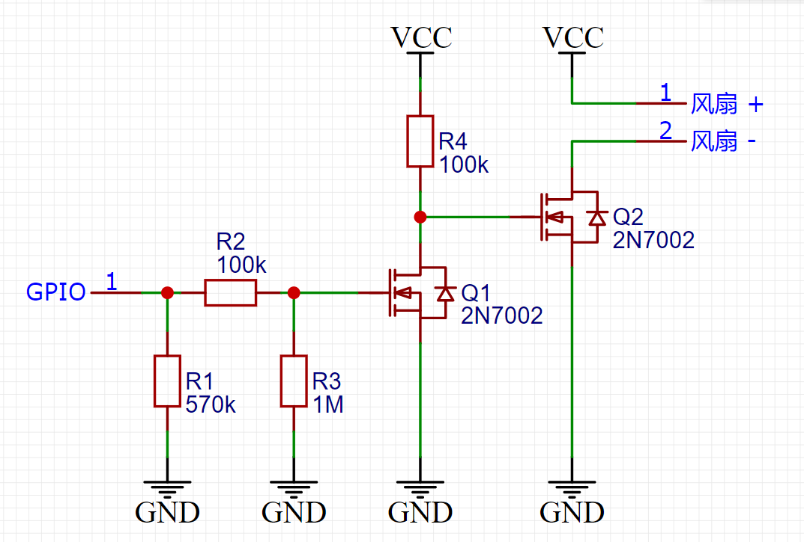

# 适用于香橙派的CPU风扇控制程序

这是一款适用于香橙派（OrangePi）的CPU风扇控制程序，通过定时读取CPU温度来调节风扇。  
本人只在 香橙派 Zero 上测试过，在香橙派其它型号或者其它类似产品上不一定能完全工作。

## 主要功能
1. 根据CPU温度自动开关风扇
2. 可以使用PWM调节风扇速度
3. 可以调节CPU频率来降温
4. 可以设定温度过高重启或关机

## 安装
```shell
wget https://github.com/yanxiangrong/Fan-Control/releases/download/1.1/fanControl_1.1-1_all.deb -o fanControl_1.1-1_all.deb
sudo dpkg -i fanControl_1.1-1_all.deb
```
安装后会创建一个名为 `fan-control.service` 的服务。并且设置为开机自启。  
安装完成后程序立即在后台运行，可以使用 `systemctl status fan-control` 查看状态  
卸载命令
```shell
sudo dpkg -r fan-control
```

## 配置

配置文件在 `/etc/fanControl/config.conf`  
内容如下所示
```ini
[common]
detectionInterval = 10         # 定时读取CPU温度间隔， 单位秒

# 开关式风扇控制
[fan]
enable            = true       # 设为 true 启用该功能，设为 false 禁用该功能
fanGPIO           = 3          # 控制风扇的 GPIO
fanOnTemp         = 50         # 开启风扇的温度阀值（大于或等于），单位摄氏度
fanOffTemp        = 40         # 关闭风扇的温度阀值（小于），单位摄氏度

# PWM风扇控制
[pwm_fan]
enable            = false
pwmGPIO           = 3
fanOffTemp        = 40
fanOnTemp         = 50
fanMaxTemp        = 60
fanMinPWM         = 30         # PWM值，范围[0, 100]
fanMaxPWM         = 100

# CPU频率控制
[cpu_freq]
enable            = true
highTemp          = 60         # CPU 高温状态阀值
highTempGovernor  = powersave  # CPU 高温状态使用的CPU调度器
lowTemp           = 50         # CPU 正常温度状态阀值
lowTempGovernor   = ondemand   # CPU 正常温度状态使用的CPU调度器

# 过热重启
[reboot]
enable            = true
rebootTemp        = 70         # CPU 温度大于该温度时重启

# 过热关机
[shutdown]
enable            = true
shutdownTemp      = 80         # CPU 温度大于该温度时关机
```
查看CPU温度：（结果除以1000）
```shell
cat /sys/class/thermal/thermal_zone0/temp
```
查看系统支持的CPU调度器：
```shell
cat /sys/devices/system/cpu/cpufreq/policy0/scaling_available_governors
```
查看当前使用的CPU调度器：
````shell
cat /sys/devices/system/cpu/cpufreq/policy0/scaling_governor
````
PWM控制功能需要系统支持硬PWM，若要使用软PWM，请看 高级配置->使用软PWM

## 高级配置

### 更改风扇控制电平

在`main.cpp`文件中有如下几行宏定义
```c++
#define FANON LOW       # 使用低电平开启风扇
#define FANOFF HIGH     # 使用高电平关闭风扇
#define PWM_REVERSE     # 反转PWM电平
//#define USE_SOFT_PWM  # 使用软PWM
```
`LOW` 表示低电平，`HIGH`表示高电平，作相应修改即可。  
若要更改PWM控制电平，注释或取消注释宏定义`PWM_REVERSE`即可。  

### 使用软件PWM

若要使用软件PWM，取消注释`USE_SOFT_PWM`。  
本人在 OrangePi Zero 上实测软PWM需要消耗大约0.6%的CPU使用量，因此不建议使用软PWM。

## 开发

取消注释宏定义`#define DEBUG`可以打开调试模式。  
在调试模式下，程序会打印每次检测的CPU温度，并且打印操作日志。

`rudeconfig`库用来读取和解析配置文件。使用前需要编译安装，详情请参考 [lib/rudeconfig-5.0.5/INSTALL](./lib/rudeconfig-5.0.5/INSTALL)  
`wiringOP`是香橙派GPIO库文件。使用前需要编译安装，详情请参考 [lib/wiringOP/INSTALL](./lib/wiringOP/INSTALL)

### 一些有用的命令

刷新 `systemctl`
```shell
systemctl daemon-reload
```
开启风扇控制服务
```shell
systemctl start fan-control
```
停止服务
```shell
systemctl stop fan-control
```
开启开机启动
```shell
systemctl enable fan-control
```
关闭开机启动
```shell
systemctl disable fan-control
```

创建deb软件包  
先进入项目根目录
```shell
chmod 755 package/usr/bin/fanControl
chmod 755 package/DEBIAN/postinst
chmod 755 package/DEBIAN/postrm
dpkg -b package fanControl_1.1-2_all.deb
```
压力测试
```shell
stress -c 4
```

## 常见疑问

### 如何让我的风扇在控制程序未正常工作或者系统未正常工作时运转？

这个功能需要硬件支持，需要在GPIO悬空或者GPIO为低电平时风扇工作，GPIO为高电平时风扇不工作。下面给出作者使用的风扇驱动电路。  


VCC 使用5V、3.3V均可，GPIO逻辑电平5V，3.3V均可。
